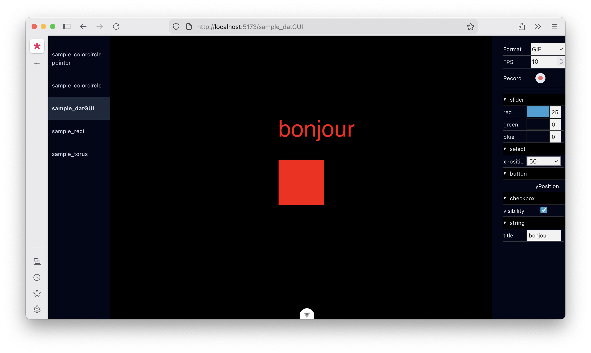

# WARNING: VERY MUCH IN A BETA PHASE


# A p5.js multi editor

A local web application allowing quick switching between sketches. New p5 files are hot-reloaded automatically added to the left  bar.

The motivation is to provide the best of both worlds between the "default" mode and the [instance mode](https://github.com/processing/p5.js/wiki/Global-and-instance-mode#when-is-global-mode-assumed).

- Like [in the web editor](https://editor.p5js.org/), you can write concise code and quickly experiment with new sketches.
- Like in instance mode, you get inline documentation (by TS typings) and the comfort of a full IDE.
- Screenshot and video recording
- Instant parameters tweaking, via Dat GUI support.



## Setup

1. Clone.
2. Run `npm install`.
5. Run `npm run dev` to launch the app and `npm run update-files` to hot-reload files.
6. Add .js or .ts files in the folder named p5. See sample files for examples.

Every file in the `sketches` folder must

- include a `draw` function
- Export your functions with a named export. Basically every P5 global function listed [here](https://github.com/processing/p5.js/blob/main/src/core/friendly_errors/fes_core.js#L80) should work, as long as you export them.

## How it works

Every file in the p5 folder must at least have a `draw` function, exported with a named export.

Everytime  you click on a sketch in the left bar, `draw()`, `setup()` and other primitives are added to the global `window` object (replacing potential previous occurences) and the `p5()` constructor is called. This constructor picks these two function and execute them.

## Warnings

- Not tested with so many p5 files or the whole p5 API.
- p5.js v2 only
- No cross-platform testing
- No performance test, especially with heavy files (WebGL and such).

## Dat GUI support

The tool has partial declarative support for [dat GUI](https://github.com/cyrilf/vue-dat-gui/). A sketch must exports a object named `vars`, for instance:

```
export let vars = {
	folderExample: {
		checkboxExample: true
	},
```

Each sub-object will be considered a folder in the Dat GUI sense. Every value in that object will be added to that folder as widgets. Each key will be used as label for the widget.

The type of value automatically determines the type of widget:

- DatBoolean : expects a boolean to display a checkbox
- DatButton: expects a function to display a button
- DatNumber: expects an object with:
```
{
	value: number
	min: number
	max: number
	step: number
}
```
- DatSelect: expects an object
```
{
	currentValue: string
	options: string[]
}
```
- DatString: expects a string
- No support for color picker.


## Credits

- The capture feature is borrowed from [P5.capture](https://github.com/tapioca24/p5.capture)
- [Vue Dat GUI](https://github.com/cyrilf/vue-dat-gui/)