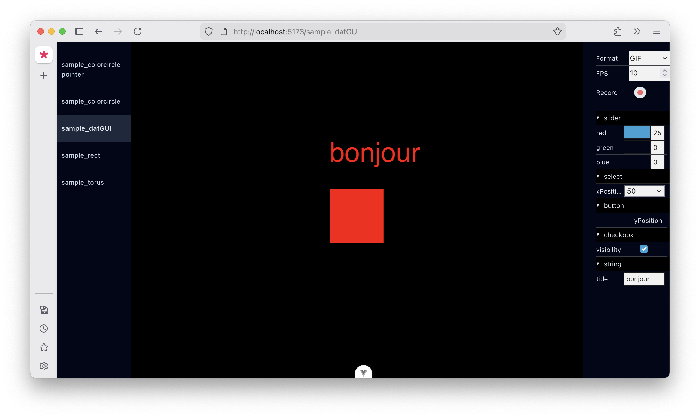

WARNING: VERY MUCH IN A BETA STATE

# A p5.js multi editor

A local web application allowing quick switching between sketches. New p5 files are hot-reloaded automatically added to the left  bar.

The motivation is to provide the best of both worlds between the "default" mode and the [instance mode](https://github.com/processing/p5.js/wiki/Global-and-instance-mode#when-is-global-mode-assumed).

- Like [in the web editor](https://editor.p5js.org/), you can write concise code and quickly experiment with new sketches.
- Like in instance mode, you get inline documentation (by TS typings) and the comfort of a full IDE.

## Setup

1. Clone.
2. `npm install`.
5. Run `npm run dev` to launch the app and `npm run update-files` to hot-reload files.
6. Add .ts files with P5 code in the folder named sketches. See sample files for reference.

Every file in the `sketches` folder must

- be a .ts file
- include a `draw` function
- Export it with a named export (no `default`). Basically every P5 global function listed [here](https://github.com/processing/p5.js/blob/main/src/core/friendly_errors/fes_core.js#L80) should work, as long as you export them.

## How it works

For one sketch:

1. `draw()`and other function exports are imported from your file in the `sketches` folder and added to the global `window` object.
2. If no `setup` is present, a basic fallback is provided.
2. P5 is called, detects these functions ([see rules](https://github.com/processing/p5.js/wiki/Global-and-instance-mode#when-is-global-mode-assumed)), runs the sketch and inserts a `canvas` in `index.html

Adding several sketches in the mix:

1. Running `updateFileList.ts` creates a `files.json`file. The Vue app uses the file list to populate the left navigation bar.
2. Everytime  you click on a sketch in the left bar, functions are imported again, overwriting previous `windows` properties. Vue is only used for routing and state management, it's always the same component instance.

## Warnings

- No cross-platform testing
- No serious memory leak testing
- No performance test with heavy files (WebGL and such).

